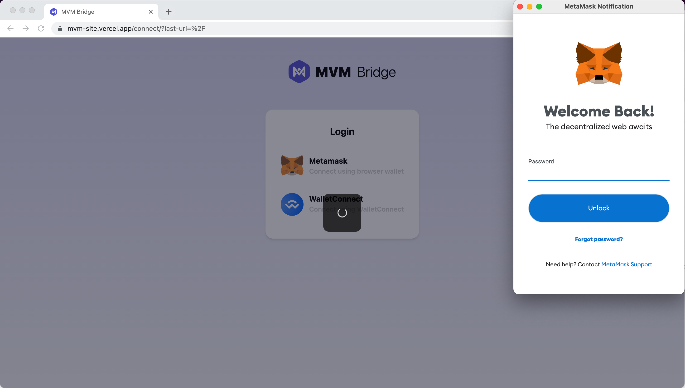
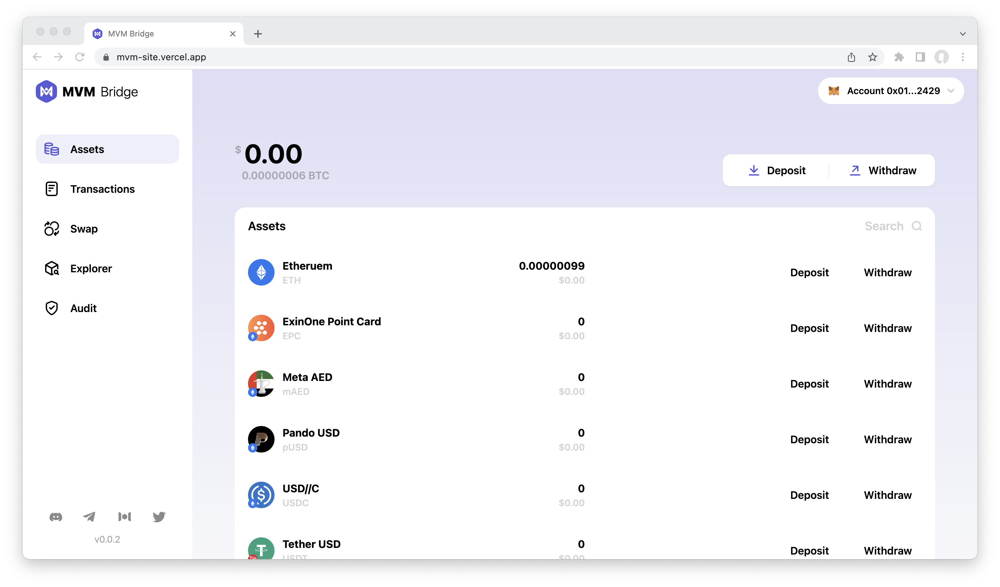

# Connect Wallet
Open the [MVM Bridge](https://bridge.mvm.app/) page and choose the way to connect the wallet:
## Metamask
If you installed the extension, it will automatically pop up a window and lead you to connect. 

If you didn't install the extension, please read the [Preparation](../Preparation/preparation.md) document.
## ConnectWallet
You need to use the following app to scan the QR code and connect the wallet.
Then you will enter the homepage of MVM:

### Related resources:
* [Preparation](../Preparation/Preparation.md)
* [How to Deposit](../Deposit/README.md)
* [How to Swap](../Swap/README.md)
* [How to withdraw](../Withdraw/README.md)