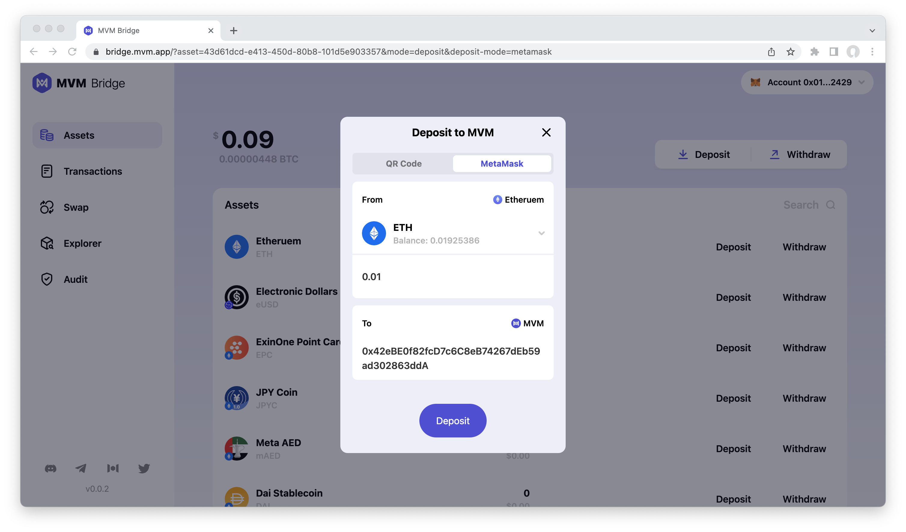

# How to deposit on MVM?
After you successfully connect the wallet, you will get a page like this:

Mixin Network has supported 41 public chains, so you can deposit any assets the network supports. Here we take ETH as an example:
1. Tap deposit, and you will get a page like this:

2. Input the amount you want to deposit
3. Verify on the MetaMask

4. Check the deposit on the MVM page.

**Please note that:**
1. The deposit transfer is not real-time because of transaction speed and the confirmation requirement.
2. It will charge a small amount of ETH as the gas fee. Please ensure it has enough ETH on balance.

### Related resources:
* [Preparation](../Preparation/Preparation.md)
* [Connect Wallet](../ConnectWallet/README.md)
* [How to Swap](../Swap/README.md)