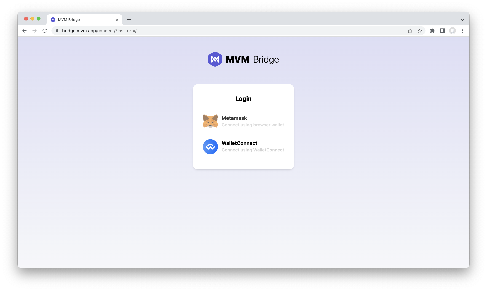

# Preparation
MVM bridge is a cross-chain smart contract platform that helps decentralized wallet users to use Mixin Network through MVM.
Please visit the [page](https://bridge.mvm.app/). You will see a page like this:

MVM provides two ways to connect your decentralized wallets:
## Metamask
You can install the [Metamask extension for Chrome browser](https://chrome.google.com/webstore/detail/metamask/nkbihfbeogaeaoehlefnkodbefgpgknn). If you're new to Metamask, the article [Getting start with Metamask](https://metamask.zendesk.com/hc/en-us/articles/360015489531-Getting-started-with-MetaMask) may help you start using it.
## WalletConnect
You can connect the wallet by scanning the QR code or the following wallet that ConnectWallet supports.

