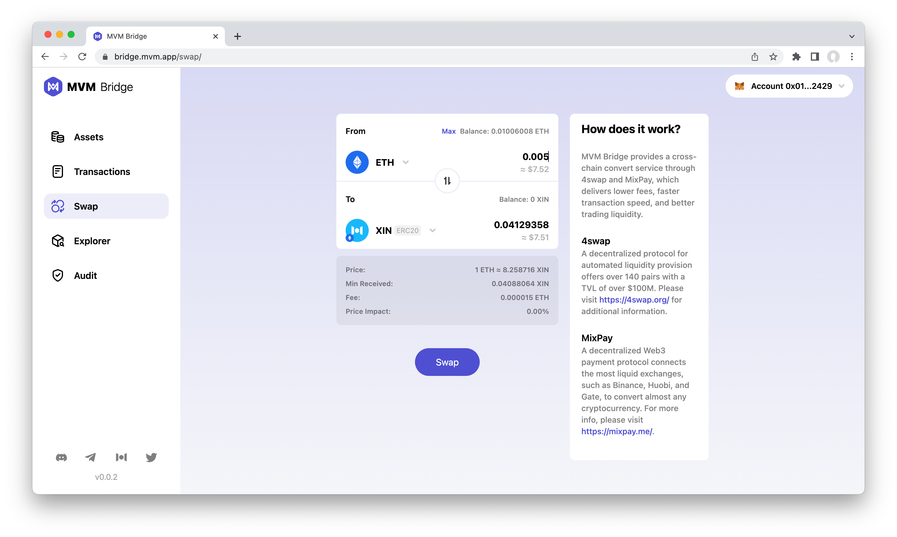
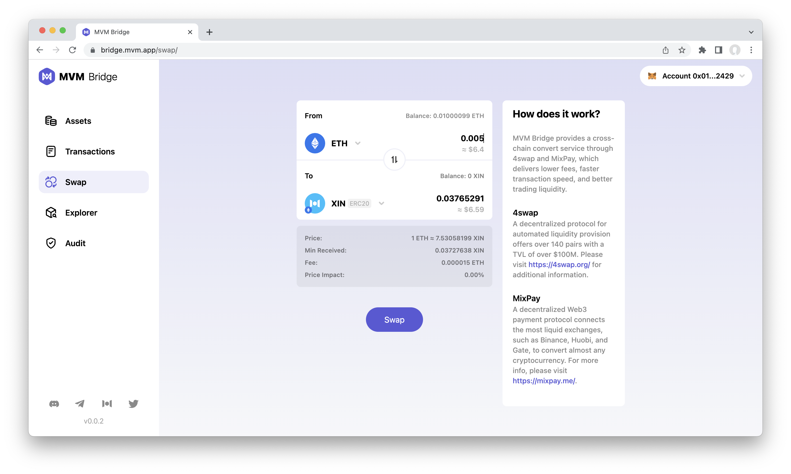
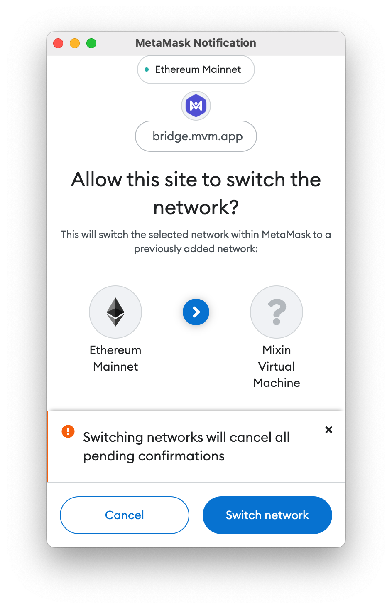
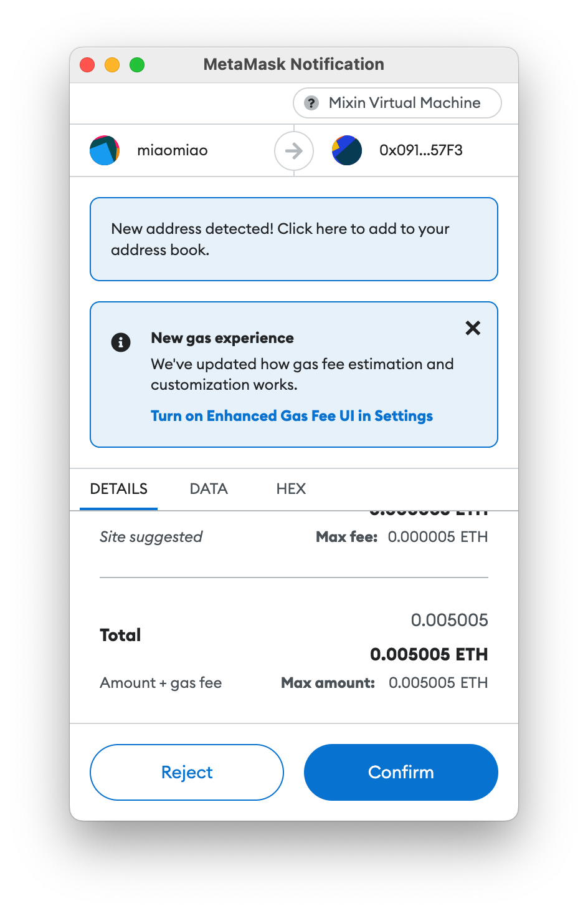
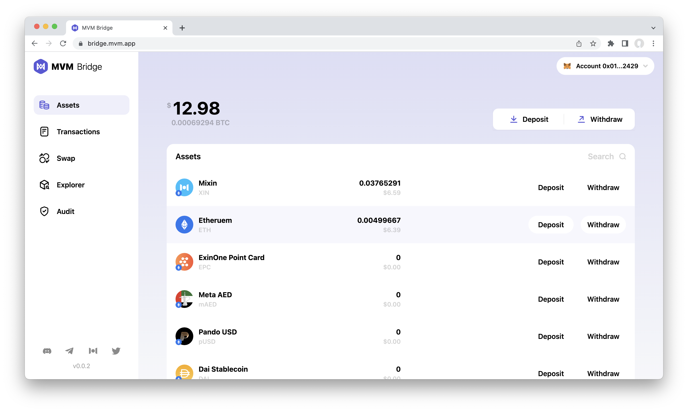

# How to swap?
Tap the "Swap" button on the sidebar, and then you can start swapping tokens.

1. Tap the down arrow to choose the assets you want to exchange.

2. Input the amount.

3. Confirm the swap.

**Attention:**

For the first time to the confirm operation, it will ask you to add the MVM network:

And then the Metamask switches to the MVM network:

Then continue to confirm:

4. Wait for transferring.

**Please note that:**
1. 4swap and Mixpay provide the swap services. The receiving amount is affected by the trading liquidity and volume. It may fail if the slippage is huge.
2. It will charge a small amount of ETH as the gas fee.

### Related resources:
* [Preparation](../Preparation/Preparation.md)
* [Connect Wallet](../ConnectWallet/README.md)
* [How to Deposit](../Deposit/README.md)