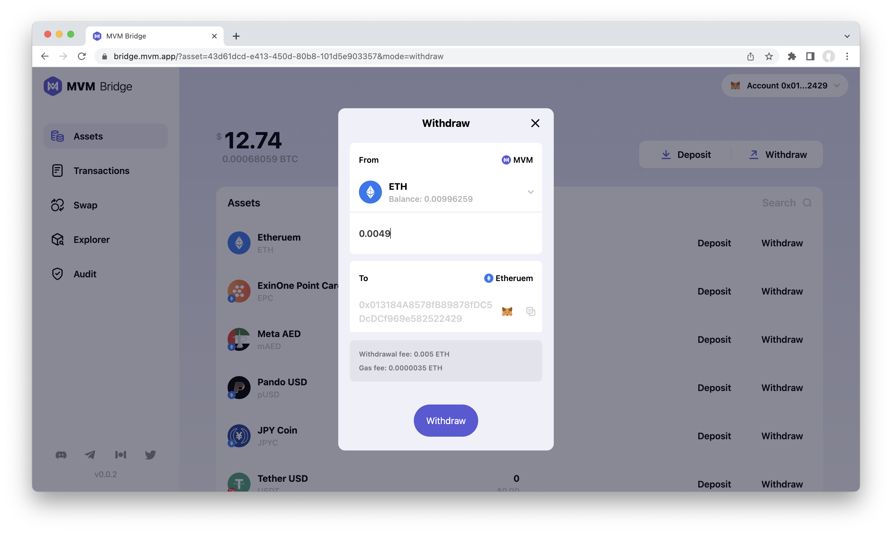
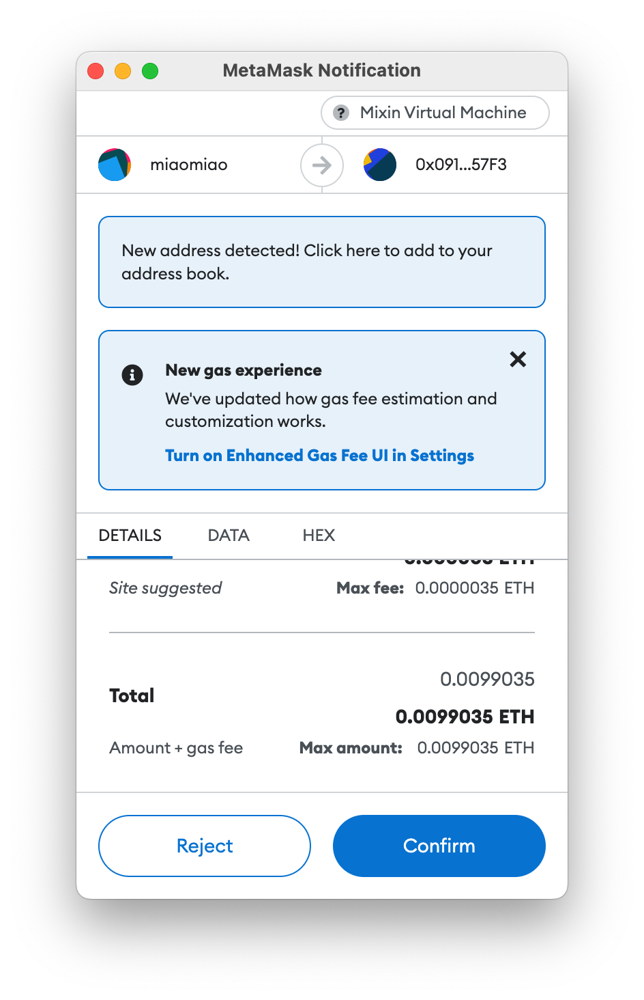

# How to withdraw from the MVM?
1. Click the asset which you want to withdraw
2. Input the withdrawal amount

3. Confirm from the Metamask

Then you can check the withdrawal on your wallet.

### Related resources:
* [Preparation](../Preparation/Preparation.md)
* [Connect Wallet](../ConnectWallet/README.md)
* [How to Deposit](../Deposit/README.md)
* [How to Swap](../Swap/README.md)
